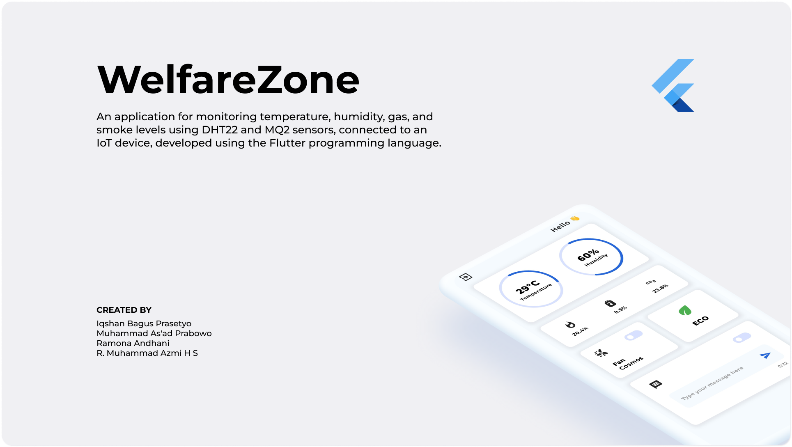

  
# WelfareZone

  

Aplikasi monitoring suhu, kelembaban, gas, dan asap yang terhubung dengan perangkat IoT menggunakan sensor DHT22 dan MQ2 adalah aplikasi yang bertujuan untuk memonitor kondisi lingkungan dalam ruangan dengan bantuan perangkat elektronik. Aplikasi ini menggunakan bahasa pemrograman Flutter untuk membuat antarmuka yang user-friendly dan mudah dioperasikan oleh pengguna.
  
Sensor DHT22 digunakan untuk mengukur suhu dan kelembaban dalam ruangan, sedangkan sensor MQ2 digunakan untuk mendeteksi konsentrasi gas dan asap. Kedua sensor ini terhubung dengan perangkat IoT yang dapat terhubung dengan aplikasi monitoring melalui jaringan internet.
  
Aplikasi monitoring ini memiliki beberapa fitur, antara lain :
  
Monitoring kondisi lingkungan : Aplikasi ini dapat menampilkan data suhu, kelembaban, konsentrasi gas, dan asap dalam ruangan secara real-time pada antarmuka aplikasi. Hal ini memudahkan pengguna untuk mengetahui kondisi lingkungan dalam ruangan dan mengambil tindakan yang diperlukan.
  
Mengontrol perangkat : Aplikasi ini juga dapat mengontrol perangkat yang terhubung, seperti kipas atau alat penghembus udara, sesuai dengan kondisi lingkungan yang terdeteksi. Misalnya, jika suhu di dalam ruangan terlalu tinggi, aplikasi dapat menyalakan kipas untuk membantu mengurangi suhu.
  
Menampilkan data pada LCD display : Aplikasi ini juga dapat menampilkan data suhu, kelembaban, konsentrasi gas, dan asap pada LCD display yang terpasang pada sensor box. Hal ini memudahkan pengguna untuk melihat data secara langsung pada sensor box.
  
Memberikan notifikasi : Aplikasi ini juga dapat memberikan notifikasi pada pengguna tergantung pada kondisi lingkungan yang terdeteksi. Misalnya, jika konsentrasi gas di dalam ruangan terlalu tinggi, aplikasi dapat memberikan notifikasi kepada pengguna untuk segera meninggalkan ruangan dan mematikan perangkat yang terhubung.
  
Dengan menggunakan aplikasi monitoring suhu, kelembaban, gas, dan asap yang terhubung dengan perangkat IoT menggunakan sensor DHT22 dan MQ2, pengguna dapat dengan mudah memonitor kondisi lingkungan dalam ruangan dan mengambil tindakan yang diperlukan untuk menjaga kesehatan dan keamanan lingkungan dalam ruangan.

  
# WelfareZone Mobile View
  

